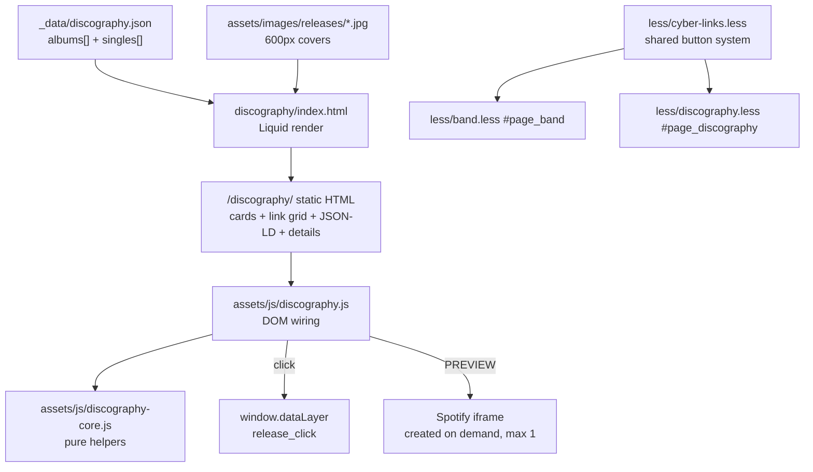

# Discography Cyberpunk Design

**Spec**: `.specs/features/discography-cyberpunk/spec.md`
**Context**: `.specs/features/discography-cyberpunk/context.md`
**Status**: Draft

---

## Architecture Overview

Static-first, exactly like `videos`: a frozen JSON catalog drives Liquid templating at build time; JavaScript only adds the Spotify preview and the analytics push. Nothing about the listening links depends on script execution.



The catalog is produced once during implementation (iTunes Lookup API, Deezer public API, manual verification for the platforms without a public lookup) and committed. No build-time network access, no operational script - conforms to **AD-001**.

---

## Code Reuse Analysis

### Existing Components to Leverage

| Component | Location | How to Use |
| --- | --- | --- |
| Cyber panel shell (`.cyber-zone`, `.cyber-zone-inner`, `.cyber-panel`, `.cyber-panel-tab`, `.cyber-panel-body`, corner spans, `data-hud`) | `less/videos.less:41+`, `videos/index.html:11+` | Copy the structural pattern into `#page_discography`; same class names, same markup order. |
| Platform button system (`.cyber-link-btn`, `.cyber-link-name`, `.cyber-link-sub`, per-platform hover colors) | `less/band.less:590-730` | **Move** into `less/cyber-links.less`; band imports it and loses its local copy. |
| Data-driven page pattern | `_data/videos.json` + `videos/index.html` | Same shape of solution for `_data/discography.json`. |
| Pure-helpers + DOM-wiring JS split | `assets/js/videos-core.js` + `assets/js/videos.js` | Same split: `discography-core.js` (testable, no DOM) + `discography.js`. |
| Per-page script include | `_includes/js/videos.liquid` (`` + page scripts) | New `_includes/js/discography.liquid`; page front matter sets `jspath: js/discography`. |
| Unit test pattern | `tests/videos/videos-data.test.cjs` (`node:test`, requires the JSON directly) | New `tests/discography/discography-data.test.cjs`. |
| E2E pattern | `tests/videos/*.e2e.cjs` + `playwright.config.cjs` | New `tests/discography/*.e2e.cjs`; the config already globs `tests/**/*.e2e.cjs`. |
| Liquid `limit` / `offset` on `for` | verified working on the installed liquidjs 6.4.3 | 6 visible singles (`limit:6`) + the rest (`offset:6`) with no custom filter. |

### Integration Points

| System | Integration Method |
| --- | --- |
| Eleventy 0.12 + liquidjs 6.4.3 | Page stays a front-mattered `.html` under `discography/`; `_data/discography.json` is auto-exposed as `discography`. |
| GTM (`GTM-WW9HZGP`, `_includes/head/gtm.liquid`) | `window.dataLayer.push` from `discography.js`; tag configuration stays in the GTM console. |
| Cache-busting transform (`.eleventy.js:31`) | New `/assets/js/discography*.js` and the rebuilt `style.min.css` pick up `?v=<hash>` automatically. |
| `/preorder/` and `/store/` | Plain internal anchors from the release cards. |
| html-minifier (`.eleventy.js:44`) | `collapseWhitespace` only; `minifyJS` is off, so inline JSON-LD is passed through untouched. |

---

## Components

### `_data/discography.json`

- **Purpose**: The catalog - the single source of truth for releases, links, tracks and covers.
- **Location**: `_data/discography.json`
- **Interfaces**: `{ albums: Release[], singles: Release[] }` (see Data Models). Pre-split by type so no `where`-style filter is needed on liquidjs 6.
- **Dependencies**: cover files under `assets/images/releases/`.
- **Reuses**: the `_data/videos.json` convention.

### `discography/index.html`

- **Purpose**: Render the page - index panel, three album cards, singles panel, JSON-LD.
- **Location**: `discography/index.html`
- **Interfaces**: front matter `page_id: discography`, `jspath: js/discography`, `header_img_path: header_4.jpg`; consumes the `discography` data global.
- **Dependencies**: `_layouts/base.html`, the catalog, the covers.
- **Reuses**: the panel markup vocabulary from `videos/index.html`.

Panel layout:

| Panel | Tab | `data-hud` | Contents |
| --- | --- | --- | --- |
| Index | `DISC::INDEX` | `CATALOG.INDEX // <n>_` | Release + single counters, one anchor per album |
| One per album | `REL::2021` / `REL::2018` / `REL::2016` | `RELEASE.<SLUG> // <n> TRACKS_` | Cover, title/year/track count, primary + secondary link grid, BUY CD, PREVIEW + empty preview slot, tracklist `<details>`, JSON-LD |
| Singles | `DISC::SINGLES` | `SINGLES.INDEX // <n>_` | 6 single cards, then `<details>` with the rest |

### `_data/platforms.json`

- **Purpose**: Presentation registry for the eight platforms, so the page renders one loop instead of eight hand-written buttons.
- **Location**: `_data/platforms.json`
- **Interfaces**: `Platform[]` in display order - `{ key, name, sub, icon, primary }`, where `key` matches a `Release.links` key and `primary` marks Spotify and Apple Music.
- **Dependencies**: none.
- **Reuses**: the icon classes and sub-labels already used at `band/index.html:117+`.
- **Note**: this replaces the `release-links.liquid` partial from the first design draft. Verified on the installed liquidjs 6.4.3 that `` resolves a dynamic key, so a registry loop covers both the album grid and the singles' compact links without a shared partial - and the singles' markup is different enough that a partial would have needed a branch anyway.

### `less/cyber-links.less`

- **Purpose**: The shared platform-button system, extracted verbatim from `band.less`.
- **Location**: `less/cyber-links.less`, imported by `less/style.less` before `band.less` and `discography.less`.
- **Interfaces**: mixin `.cyber-links-system()` invoked inside `#page_band` and `#page_discography`, so the emitted selectors stay page-scoped and the band's rendered CSS is byte-equivalent.
- **Dependencies**: none.
- **Reuses**: the exact declarations currently at `less/band.less:590-730`.

### `less/discography.less`

- **Purpose**: Page theme - cyber zone, panels, release card grid, singles grid, tracklist, preview slot.
- **Location**: `less/discography.less` (replaces the current 5-line file).
- **Interfaces**: everything scoped under `#page_discography`.
- **Dependencies**: `cyber-links.less`.
- **Reuses**: `less/videos.less` panel styles as the base; redeclares `.cyber-zone-inner { width:100%; max-width:100% }` to escape the unscoped leak from `less/contact.less:328`.

### `assets/js/discography-core.js`

- **Purpose**: Pure, DOM-free helpers - testable under `node:test`.
- **Location**: `assets/js/discography-core.js`
- **Interfaces**:
  - `spotifyEmbedUrl(albumId): string` - `https://open.spotify.com/embed/album/<id>` (verified 200; the legacy `embed?uri=` form is not used).
  - `clickEvent(platform, slug): object` - `{ event:'release_click', platform, release: slug }`.
  - `nextPreviewState(current, requested): {open: string|null}` - toggle/switch logic for the one-preview-at-a-time invariant.
- **Dependencies**: none. Exposed as `window.IDDiscographyCore` and, when `module` exists, via `module.exports` (same dual export as `videos-core.js`).

### `assets/js/discography.js`

- **Purpose**: Wire the DOM - preview toggling and click tracking.
- **Location**: `assets/js/discography.js`
- **Interfaces**: on `DOMContentLoaded`, unhides `[data-disc-preview-btn]`, binds preview clicks and delegates platform-anchor clicks.
- **Dependencies**: `discography-core.js`.
- **Reuses**: the progressive-enhancement posture of `assets/js/videos.js` (controls ship `hidden`, script reveals them).

### Tests

| File | Type | Covers |
| --- | --- | --- |
| `tests/discography/discography-data.test.cjs` | node:test | DISC-43, DISC-46 (data integrity, slug uniqueness, cover existence, platform keys, durations) |
| `tests/discography/discography-core.test.cjs` | node:test | DISC-21..25 logic, DISC-39/41 event shape |
| `tests/discography/markup.e2e.cjs` | Playwright | DISC-01..07, DISC-15..20, DISC-35..38 |
| `tests/discography/theme.e2e.cjs` | Playwright | DISC-08..14 (panel vocabulary, anchors, no legacy player markup, band unchanged) |
| `tests/discography/preview.e2e.cjs` | Playwright | DISC-21..28, DISC-44 |
| `tests/discography/seo.e2e.cjs` | Playwright | DISC-29..34 (tracklist, JSON-LD, local covers, img dimensions) |
| `tests/discography/tracking.e2e.cjs` | Playwright | DISC-39..42 |
| `tests/discography/nojs.e2e.cjs` | Playwright | DISC-07, DISC-18, DISC-27, DISC-42 with `javaScriptEnabled: false` |

`npm run test:unit` already globs `tests/*/*.test.cjs`; Playwright already globs `tests/**/*.e2e.cjs`. No config change needed.

---

## Data Models

```typescript
interface Catalog {
  albums: Release[]   // newest first: 2021, 2018, 2016
  singles: Release[]  // newest first
}

interface Release {
  slug: string          // kebab-case, unique across the whole catalog; used as anchor id
  title: string
  year: number
  releaseDate: string   // ISO yyyy-mm-dd, feeds MusicAlbum.datePublished
  cover: string         // filename under assets/images/releases/
  coverWidth: number    // intrinsic px of the shipped file
  coverHeight: number
  type: 'ALBUM' | 'DELUXE' | 'SINGLE'
  spotifyId: string | null   // album id, drives the lazy embed
  links: {                   // any key may be null -> button omitted
    spotify: string | null
    apple: string | null
    ytmusic: string | null
    deezer: string | null
    tidal: string | null
    amazon: string | null
    pandora: string | null
    bandcamp: string | null
  }
  buyCd: string | null       // '/preorder/' | '/store/' | null
  tracks: Track[]            // [] for singles
}

interface Track {
  position: number
  title: string
  duration: number     // seconds; rendered m:ss, emitted as ISO 8601 PTxMyS
}
```

**Relationships**: `slug` is the anchor id and the `release` value in the analytics event; `links` keys are exactly the eight supported platforms; `cover` must resolve to a file on disk - all four are enforced by `discography-data.test.cjs`.

---

## Error Handling Strategy

| Error Scenario | Handling | User Impact |
| --- | --- | --- |
| Platform has no page for a release | `links.<platform>` is `null`; template renders nothing | Sees only buttons that work |
| Spotify iframe blocked or fails to load | Nothing else depends on it; cover, links and tracklist are untouched DOM | Preview area stays empty; every listening route still works |
| JavaScript disabled or fails | Anchors are plain `<a href>`; singles overflow is a native `<details>`; PREVIEW buttons ship `hidden` and are only revealed by script | Full catalog and every link usable; no preview |
| `window.dataLayer` undefined (GTM blocked by an ad blocker) | `window.dataLayer = window.dataLayer || []` before push | None - navigation unaffected |
| Cover file missing | Unit test fails the build-time gate | Never reaches production |
| Duplicate slug | Unit test fails | Never reaches production - would break anchors |
| Dead platform URL | Authoring-time HTTP check; non-2xx/3xx becomes `null` | Never ships a broken link |

---

## Risks & Concerns

| Concern | Location (file:line) | Impact | Mitigation |
| --- | --- | --- | --- |
| Unscoped `.cyber-zone-inner { max-width: 56rem }` leaks site-wide | `less/contact.less:328` | Discography panels would be capped at 560px regardless of their own width | Redeclare `width:100%; max-width:100%` inside `#page_discography`, the same escape videos already documents at `less/videos.less:72-79`; note as a site-wide cleanup candidate |
| `.cyber-zone` / `.cyber-panel` are copy-pasted per page | `less/videos.less:41`, `less/band.less`, `less/photos.less` | Theme drift between pages; a fix must be applied N times | This feature extracts only the button system (spec DISC-11). Full theme extraction is a follow-up, deliberately not bundled here |
| Extracting CSS touches the stable band page | `less/band.less:590-730` | A regression on a page nobody asked to change | Extract as a mixin invoked inside `#page_band`, so generated selectors are identical; `theme.e2e.cjs` asserts the band's button computed styles before/after |
| Eleventy 0.12 / liquidjs 6.4.3 are old | `package.json:26` | Modern Liquid filters (`where`, `map` chains) may not exist | Data is pre-split into `albums`/`singles` and paging uses `limit`/`offset`, both verified working on the installed version |
| No public lookup API for Spotify, Tidal, Amazon, Pandora, YT Music | - | Links for those platforms must be found by hand and can be wrong | Every URL is HTTP-checked at authoring time; anything not verified ships as `null` (DISC-46) - an omitted button, never a wrong one |
| ~21 cover images enter the repo | `assets/images/releases/` | Repo growth, slower clone | 600px JPEG, quality ~82, target <=120KB each (~2MB total); `loading="lazy"` on all but the first |
| Legacy Universal Analytics still loaded | `_includes/head/analytics.liquid:8` | `ga()` events would go nowhere | Tracking uses `dataLayer` only; UA cleanup is out of scope |
| `/preorder` sells a 2021 album under a pre-order name | `preorder/index.html:4` | Confusing destination | Button says "Buy CD"; renaming the page is out of scope |
| Playwright `webServer.url` waits on `/photos/` | `playwright.config.cjs:8` | None today, but couples e2e startup to the photos page | Leave as is; discography specs navigate explicitly |

---

## Tech Decisions

| Decision | Choice | Rationale |
| --- | --- | --- |
| Catalog production | One-off manual authoring, JSON committed, no refresh script | Conforms to AD-001 (local static data, no operational scripts); confirmed by the user |
| Data shape | Pre-split `albums` / `singles` | liquidjs 6.4.3 has no dependable `where`; pre-splitting removes the need |
| Singles paging | `` + `<details>` with `offset:6` | Native disclosure keeps "load more" working without JS |
| Spotify embed URL | `https://open.spotify.com/embed/album/<id>` | Current documented form; verified HTTP 200. Legacy `embed?uri=spotify:album:` also answers but is deprecated |
| Shared CSS mechanism | LESS mixin invoked per page, not a bare global ruleset | Keeps selectors page-scoped, so the band's compiled CSS does not change |
| Preview container | Empty `div` in the markup, iframe injected on click | Guarantees zero `open.spotify.com` requests on load (a success criterion) |
| Analytics | `dataLayer.push` only, no `preventDefault` | Event must not delay or intercept navigation (DISC-40) |
| JSON-LD placement | One `<script type="application/ld+json">` per album, inside the album panel | Keeps the data next to the markup it describes; minifier leaves it alone |
