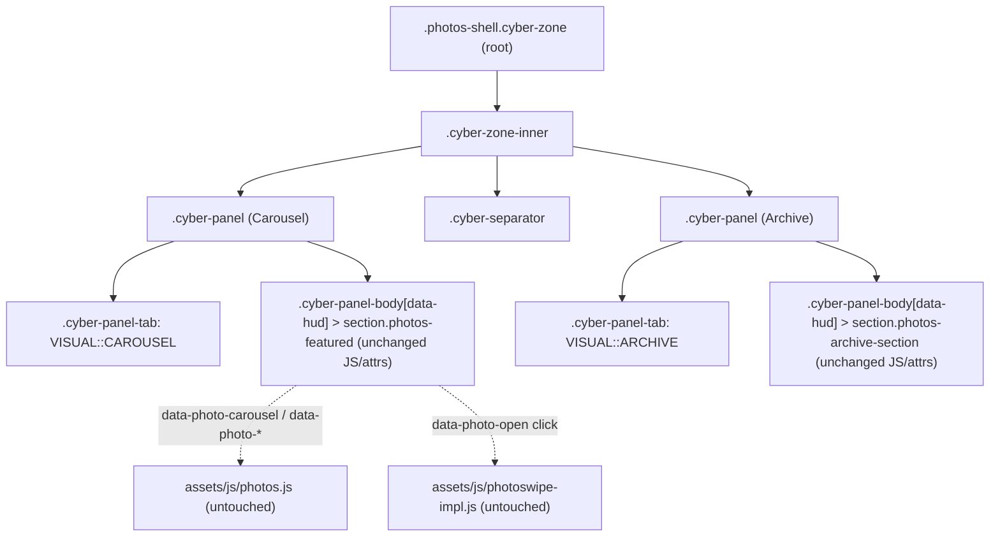

# Photos Cyberpunk Theme Refresh Design

**Spec**: `.specs/features/photos-cyberpunk-theme/spec.md`
**Status**: Draft

---

## STATE.md Decisions Check

Read `.specs/STATE.md` `## Decisions`:

- **AD-001** (cancel Instagram integration): not touched by this feature. Conformed.
- **AD-002** (2020 photoshoot ingestion, client-side highlight randomization): behavior preserved unchanged (PXCP-10). Conformed.

No decision is superseded. No new `AD-NNN` is required - the choices below (keyframe naming, panel grouping) are feature-local, not project-wide conventions, since the project's established pattern is already "each page owns its own CSS," which this design follows rather than changes.

---

## Architecture Overview

This is a presentation-layer change only. No new components, no data flow changes, no JS behavior changes. The existing `photos/index.html` gains the same three-layer wrapper structure already used by `band/index.html`, `contact/index.html` and `newsletter` (`_layouts` + `mailchimp.less`): `.cyber-zone > .cyber-zone-inner > .cyber-panel (x2) > .cyber-panel-body`. The pre-existing `.photos-shell` root element is kept and merged with `.cyber-zone` on the same node (see Tech Decisions) so every current selector, test hook and the existing reduced-motion rule keep working with only local extensions.



---

## Code Reuse Analysis

### Existing Components to Leverage

| Component | Location | How to Use |
| --- | --- | --- |
| `.cyber-zone` / `.cyber-zone-inner` / `.cyber-panel` / `.cyber-panel-tab` / `.cyber-panel-body` / `.corner-tl/tr/bl` / `.top-accent` / `.cyber-separator` markup pattern | `band/index.html:15-113`, `less/band.less:93-287` | Copy the exact HTML skeleton and the CSS shapes (borders, clip-paths, gradients) into `photos/index.html` and `less/photos.less`, page-scoped under `#page_photos` per existing convention |
| `@keyframes noise-drift`, `panel-glow`, `border-flicker`, `blink-dot`, `blink-text` | `less/band.less:22-69` | Reproduce with `photos-` prefixed names in `less/photos.less` (see Tech Decisions - not imported, duplicated per project convention and to avoid any accidental cross-page coupling) |
| Google Fonts import (`Rajdhani`, `Share Tech Mono`) | `_includes/head/styles.liquid` | Already loaded site-wide; no change needed |
| `assets/js/photos.js` carousel logic | `assets/js/photos.js:1-129` | Unchanged. All queries are attribute-scoped (`[data-photo-carousel]`, `[data-photo-slide]`, `.photos-archive figure[data-photo-id]`, etc.), not depth/parent-fragile, so adding wrapper `.cyber-panel`/`.cyber-zone` ancestors is safe (verified by reading the file) |
| `assets/js/photoswipe-impl.js`, PhotoSwipe v4.1.0 | `assets/js/photoswipe-impl.js`, `assets/js/photoswipe.min.js` | Unchanged - triggered via `[data-photo-open]`, unaffected by new ancestor markup |
| `.photos-shell` reduced-motion blanket rule | `less/photos.less:69-71` | Kept and extended (see Risks & Concerns) rather than replaced |
| `bodybg.jpg` global background | `less/general.less:14-16` | No longer overridden for `#page_photos` - becomes visible again, matching Band/Contact/Newsletter |

### Integration Points

| System | Integration Method |
| --- | --- |
| Eleventy/Liquid templating | No new includes; edits stay inside `photos/index.html`'s existing body markup between the front-matter and the PhotoSwipe root `div.pswp` |
| LESS build (`npm run less:build`) | `less/photos.less` is already imported by `less/style.less`; no import changes needed |
| Playwright test suite | `tests/photos/visual.e2e.cjs` assertions that hardcode current selectors/colors are updated in the same commit that changes the corresponding CSS (never left to drift) |

---

## Components

### `photos/index.html` (markup restructure)

- **Purpose**: Wrap the existing carousel and archive sections in the shared `.cyber-zone` / `.cyber-panel` structure without altering any functional attribute.
- **Location**: `photos/index.html`
- **Structure** (all existing inner markup - the `<section class="photos-featured" data-photo-carousel>` block and the `<section class="photos-archive-section">` block - moves unchanged inside the new wrappers):

```html
<div class="photos-shell cyber-zone">
    <div class="cyber-zone-inner">

        <div class="cyber-panel">
            <div class="cyber-panel-tab"><span class="tab-icon"></span> VISUAL::CAROUSEL</div>
            <div class="cyber-panel-body cyber-panel-body--photos-stage" data-hud="GALLERY.FEED // LIVE_">
                <span class="top-accent"></span>
                <span class="corner-tl"></span>
                <span class="corner-tr"></span>
                <span class="corner-bl"></span>
                <section class="photos-featured" aria-labelledby="photos-featured-title" aria-roledescription="carousel" data-photo-carousel>
                    <!-- unchanged: heading, .photos-stage, .photos-thumbnails -->
                </section>
            </div>
        </div>

        <div class="cyber-separator"></div>

        <div class="cyber-panel">
            <div class="cyber-panel-tab"><span class="tab-icon"></span> VISUAL::ARCHIVE</div>
            <div class="cyber-panel-body cyber-panel-body--photos-archive" data-hud="GALLERY.GRID // {{ photos.size }}_">
                <span class="top-accent"></span>
                <span class="corner-tl"></span>
                <span class="corner-tr"></span>
                <span class="corner-bl"></span>
                <section class="photos-archive-section" aria-labelledby="photos-archive-title">
                    <!-- unchanged: heading, .my-gallery.photos-archive grid -->
                </section>
            </div>
        </div>

    </div>
</div>
<!-- .pswp root: unchanged, stays as a sibling after the shell, same as today -->
```

- **Dependencies**: none new.
- **Reuses**: 100% of existing inner markup, all `data-photo-*` attributes untouched.

### `less/photos.less` (styling additions)

- **Purpose**: Give the new wrapper elements the shared cyberpunk visual treatment while keeping photos' existing accent classes (`.photos-accent`, `.photos-counter`, `.photos-frame-corner`, thumbnail selection state) as the page's secondary identity layer.
- **Location**: `less/photos.less`
- **Additions**:
  - `photos-noise-drift`, `photos-panel-glow`, `photos-border-flicker`, `photos-blink-dot`, `photos-blink-text` keyframes (values copied from `band.less`).
  - `.cyber-zone` rule scoped under `#page_photos`: `position: relative; overflow: hidden; background-color: transparent;` plus the noise (`::before`) and scanline (`::after`) pseudo-elements, using the `photos-` prefixed keyframe names.
  - `.cyber-zone-inner` rule: reuse the existing `.photos-shell` max-width (1180px) instead of Band's full-width variant, since Photos' grid layout is tuned for that width today.
  - `.cyber-panel`, `.cyber-panel-tab`, `.cyber-panel-body`, `.corner-tl/tr/bl`, `.top-accent`, `.cyber-separator` rules: copied from `band.less` with identical values (palette, clip-paths, glow) since PXCP-04/07 require the same shared look. `.tab-icon` blink animation uses `photos-blink-dot`.
  - Remove the line `#content { background: #050a10; }` (satisfies PXCP-06 - `bodybg.jpg` shows through the now-transparent `.cyber-zone`).
  - Extend the existing reduced-motion block (see Risks & Concerns below - this is the one correctness-critical change, not a copy-paste).
- **Dependencies**: none new (no new fonts/assets - `Rajdhani` and `Share Tech Mono` already loaded site-wide).
- **Reuses**: `#00f3ff` / `#005f8c` / `#ff00ea` palette already used by `.photos-accent`/`.photos-counter`/thumbnail states today - no new colors introduced.

### `tests/photos/visual.e2e.cjs` (assertion updates only)

- **Purpose**: Keep the visual regression test meaningful against the new structure.
- **Location**: `tests/photos/visual.e2e.cjs`
- **Change**: Update the hardcoded computed-style assertions that targeted the old flat markup (e.g. `.photos-stage` border-top-color) to target wherever that visual property now actually lives (e.g. `.cyber-panel-body` border, `.photos-accent` color check stays valid since that class is untouched). No assertion is deleted - each is re-pointed to its new home or confirmed unchanged.
- **Dependencies**: final selectors depend on the exact CSS written in Execute; Tasks phase will enumerate each assertion needing a look.

No changes to `assets/js/photos.js`, `assets/js/photoswipe-impl.js`, `_data/photos.json`, `_data/highlights.js`, or `_includes/js|css/photos.liquid`.

---

## Data Models

N/A - no data shape changes. `_data/photos.json` (23 entries) and `_data/highlights.js` (featured/highlightOrder selection) are untouched.

---

## Error Handling Strategy

| Error Scenario | Handling | User Impact |
| --- | --- | --- |
| JavaScript disabled | Unchanged - archive `<a>` links inside `.cyber-panel-body` remain plain anchors to full-size images (PXCP-17) | Grid still browsable, no carousel interactivity, same as today |
| `prefers-reduced-motion: reduce` | Extended blanket rule (see below) disables every animation on the page, including the two new pseudo-element animations on the root element itself | No motion, panels render static |

---

## Risks & Concerns

| Concern | Location (file:line) | Impact | Mitigation |
| --- | --- | --- | --- |
| Reduced-motion selector gap: today's rule is `.photos-shell, .photos-shell *, .photos-shell *::before, .photos-shell *::after` - it does **not** match `.photos-shell`'s *own* `::before`/`::after`. Merging `.cyber-zone` onto the `.photos-shell` root means the new noise/scanline animations live exactly on those two pseudo-elements of the root itself. | `less/photos.less:69-71` | WHILE reduced motion is requested, the root-level noise-drift and scanline animations would keep running - a regression of PXCP-14/PHOTO-15 | Extend the media query to `.photos-shell, .photos-shell::before, .photos-shell::after, .photos-shell *, .photos-shell *::before, .photos-shell *::after` as part of the same task that adds the root pseudo-elements. Add/verify a Playwright assertion that checks `animationName === 'none'` specifically on the root element's computed pseudo-style, not only its descendants. |
| Hardcoded CSS-value assertions in `visual.e2e.cjs` will fail as soon as `.photos-stage`'s border moves to `.cyber-panel-body` | `tests/photos/visual.e2e.cjs` (border-top-color assertion) | Expected, tracked failure - not a silent regression, since it's covered by a task in Tasks phase | Update assertions in the same commit as the corresponding CSS change; never leave the suite red between tasks |
| `.cyber-panel-body`'s `clip-path: polygon(...)` angular corner can clip the last row of the archive photo grid or the carousel's stage controls at narrow widths if padding isn't re-tuned | `less/band.less:195` (pattern being copied) | Visual clipping of controls/images on mobile widths (320-390px), would fail PXCP-16 | Verify at all four required widths (320/390/768/1440) during Execute before considering the task done; adjust `.cyber-panel-body`'s clip corner size or padding for Photos specifically if clipping is observed |
| Two-panel split changes the DOM distance between `.photos-stage` and `.photos-archive-section` (now under different `.cyber-panel-body` parents) | `photos/index.html` | None expected - `photos.js` and PhotoSwipe queries are attribute/document-scoped, verified above; flagged for completeness | No action needed beyond the standard test run confirming PXCP-08 through PXCP-13 still pass |

---

## Tech Decisions

| Decision | Choice | Rationale |
| --- | --- | --- |
| Root element strategy | Add `cyber-zone` as a second class on the existing `.photos-shell` element, rather than introducing a new wrapping `<div>` | Keeps the existing `.photos-shell, .photos-shell *` reduced-motion selector (and any other `.photos-shell`-scoped rule) covering every new element for free, minimizing the diff and the risk of missing a selector; the one gap this creates (root's own pseudo-elements) is explicitly patched, see Risks & Concerns |
| Keyframe naming | Prefix every reused keyframe with `photos-` (`photos-noise-drift`, etc.) instead of reusing Band's bare names | Matches the precedent Newsletter already set (`newsletter-noise`, `newsletter-glitch`, ...) for page-owned, independently-editable animations under the "duplicate, don't share" convention this project already follows |
| Panel grouping | Two `.cyber-panel` blocks (Carousel, Archive) rather than one panel for the whole page or one panel per photo | Mirrors the existing two-section DOM (`photos-featured` / `photos-archive-section`) and the multi-panel pattern used by Band/Contact/Newsletter; avoids merging two functionally distinct regions into one oversized panel |
| Secondary accent color | Keep `#ff00ea` magenta on Photos-specific elements only (`.photos-accent`, `.photos-counter`, `.photos-frame-corner`, selected-thumbnail state) - not applied to the new shared `.cyber-panel`/`.corner-bl`/tab chrome, which stays cyan/deep-blue like Band/Contact/Newsletter | Delivers the grilled outcome "same shared language, distinct identity" concretely: structural chrome matches the site, Photos' own accent still reads as Photos |
| `.cyber-zone-inner` max-width | `1180px` (Photos' existing value) instead of Band's `100%` | Photos' archive grid and stage were sized against 1180px; changing it would force re-tuning the grid column/gap math for no benefit, and per-page tuning of shared classes is already the project's convention (Contact uses `56rem`, Newsletter uses `100%`) |

No entry here rises to a project-wide convention beyond what STATE.md already records, so no new `AD-NNN` is appended.

---

## Approach Confirmation

Single approach presented (not multiple alternatives) because the architecture is fully determined by already-grilled decisions (reuse the exact shared component system, no library swap, no shared theme file) - there is no second viable structural approach left to compare once those constraints are fixed. The only real decision points (panel grouping, keyframe naming, root-element strategy) are recorded above as Tech Decisions with rationale, open for objection.
