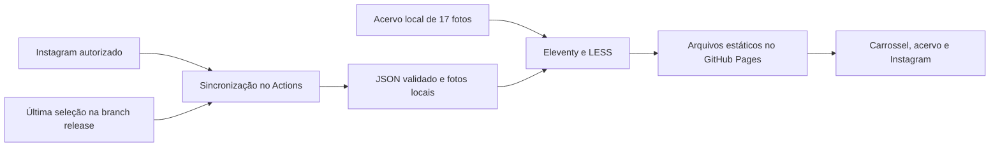

# Photos Cyberpunk Design

**Spec:** [spec.md](spec.md)
**Context:** [context.md](context.md)
**Status:** Aprovado pelo usuário em 2026-09-13.

## Architecture Overview

Preservar Eleventy, Liquid, LESS, PhotoSwipe e GitHub Pages. O navegador opera o carrossel local. O GitHub Actions consulta a API e produz uma seleção estática; o navegador não recebe tokens nem consulta a API.

A arquitetura de sincronização no build foi escolhida pelo usuário durante o grilling. As alternativas de posts manuais e widget foram discutidas e descartadas para esta entrega. Não reabrir essa decisão.



### Persistência da seleção

| Alternativa | Benefício | Custo |
| ----------- | --------- | ----- |
| Recuperar seleção da branch release existente — recomendada | Sobrevive aos runners efêmeros e reutiliza a publicação atual | Restaurar os arquivos antes de todo build de produção |
| Artifacts ou cache de Actions | Separa dados do conteúdo publicado | Retenção/expiração e seleção do artifact tornam o fallback menos confiável |
| Branch exclusiva para dados | Separa ciclos de código e conteúdo | Adiciona commits e coordenação sem necessidade nesta versão |

Usar um único workflow para push, schedule e execução manual. Restaurar somente o diretório público da seleção anterior, sem executar código da branch release. O arquivo `docs` é registrado como gitlink no repositório; não atualizar esse ponteiro nem fazer commits dentro da saída gerada.

## Visual Direction

O carrossel é o elemento principal logo após o cabeçalho existente. Uma foto grande em cor natural recebe moldura angular, contador 01 / 06 e controles ciano/magenta. Miniaturas ficam abaixo, com a selecionada identificável por borda e estado acessível. O acervo vem em seguida; a seção Instagram fecha a página.

Escopo CSS em `#page_photos`, com classes próprias `photos-*` para evitar colisões com Contact e Newsletter. Reutilizar as fontes existentes. Efeitos decorativos ficam nas bordas e no fundo, sem cobrir as fotos. Texto principal de pelo menos 16 CSS pixels; alvos de toque de pelo menos 44 CSS pixels. Grade de uma coluna no celular estreito, duas em larguras intermediárias e três em desktop. Nada de autoplay.

## Code Reuse Analysis

| Component | Location | Reuse |
| --------- | -------- | ----- |
| Template e acervo | `photos/index.html` | Preservar 17 imagens, links originais, metadados da página e visualizador |
| Lightbox | `assets/js/photoswipe.min.js` | Reutilizar versão local 4.1.0; adaptar integração, sem migração de biblioteca |
| Adaptador | `assets/js/photoswipe-impl.js` | Entrada comum para destaques e grade, retorno de foco e movimento reduzido |
| Scripts da página | `_includes/js/photos.liquid` | Carregar o controlador somente em Photos |
| Estilo | `less/photos.less` | Substituir floats e larguras fixas por layout responsivo |
| Referência visual | `less/mailchimp.less` | Paleta e molduras, sem modificar Newsletter |
| Dados globais | `.eleventy.js` e convenções Eleventy | Loader local de JSON; build permanece sem rede |
| Publicação | `.github/workflows/main.yml` | Ampliar fluxo existente com restauração e sincronização |

## Components

### Galeria estática

- **Location:** `photos/index.html`, apoiado por `_data/photos.json`.
- **Interface:** registros com id, src, thumbnail, width, height, caption, alt e destaque opcional.
- **Reuses:** links originais e PhotoSwipe.
- Extrair as 17 entradas para uma única coleção; escolher 6 destaques dessa mesma coleção. Medir as dimensões reais durante implementação, em vez de confiar no data-size antigo.
- Renderizar os links de todas as imagens no HTML; controles interativos só aparecem após inicialização bem-sucedida. Fotos fora do primeiro destaque usam lazy loading quando aplicável.

### Controlador do carrossel

- **Location:** `assets/js/photos.js`.
- **Interface:** estado privado selectedIndex, operação select(index), atualização da foto, legenda, contador e miniatura ativa.
- **Dependencies:** DOM gerado pela galeria; não depende da API.
- Navegação circular e setas de teclado somente quando o foco estiver no carrossel. Gesto horizontal mínimo de 40 px, respeitando rolagem vertical. Impedir clique de abertura após um gesto reconhecido.
- Um único ponto de abertura do PhotoSwipe; preservar o acionador para restaurar foco. Miniaturas usam botões com aria-pressed, sem anunciar troca a cada evento de pointermove.

### Integração do visualizador

- **Location:** `assets/js/photoswipe-impl.js`.
- **Interface:** função de abertura por índice do acervo e elemento acionador; chamada pelos destaques e pela grade.
- **Dependencies:** PhotoSwipe 4.1.0 local.
- Manter zoom, navegação e Escape. Tratar dimensões com normalização de x/X. Usar texto para legendas.
- Desabilitar animações de abertura/fechamento quando movimento reduzido estiver ativo.

### Sincronizador

- **Location:** `scripts/sync-instagram.cjs`.
- **Interfaces:** normalizePosts(records), synchronize({fetchImpl, snapshotDir, config}), resultado com status e contagem.
- **Dependencies:** Node 24, fetch nativo, filesystem e configuração por ambiente.
- O adaptador externo fica separado da seleção e persistência, para testes com fixtures sem credenciais reais.
- Configuração: secret `INSTAGRAM_ACCESS_TOKEN`; variables `INSTAGRAM_USER_ID` e `INSTAGRAM_API_VERSION`. Versão explícita, sem alegar uma versão vigente que não foi verificada.
- A configuração ausente não dispara rede. Retornar fallback com último snapshot ou estado vazio.
- Contrato candidato: GET no host graph.instagram.com para mídia própria e filhos, com id, media_type, media_url, permalink, timestamp e caption. Os endpoints/campos detalhados precisam ser conferidos na documentação acessível e no primeiro teste autorizado; ver Research.
- Não depender da ordem retornada: percorrer a coleção paginada disponível, deduplicar, ordenar por timestamp decrescente e ID textual crescente; só então selecionar até 12. Limite inicial: 100 páginas, 5.000 registros e 5 minutos no total. Se a coleta continuar além do limite, não declarar sucesso parcial: preservar snapshot e registrar erro de limite.
- Para álbuns, resolver apenas a primeira imagem necessária, seguindo a ordem de filhos definida pela API; se a resposta não permite determinar a capa, tratar como falha em vez de escolher arbitrariamente.
- Pedidos individuais: timeout de 15 segundos; downloads de até 15 MiB por imagem; até 12 imagens. Aceitar JPEG, PNG e WebP com assinatura compatível; não aceitar SVG ou HTML.
- URLs de mídia: HTTPS, host instagram/fbcdn permitido por sufixo de domínio validado, sem credenciais embutidas; validar novamente qualquer redirect. Não encaminhar Authorization a hosts de mídia.
- Paginação usa apenas cursor no endpoint fixo; não seguir URLs arbitrárias nem registrar respostas brutas com possíveis tokens. Detectar cursores repetidos.
- Preparar JSON e imagens em staging. Substituir snapshot somente depois de validar tudo. Em falha parcial, descartar staging e manter o anterior. Falha no build/deploy não altera o site já publicado.

### Seção Instagram

- **Location:** `_includes/photos/instagram.liquid`, apoiada por `_data/instagram.js`.
- **Interface:** snapshot validado com posts ou lista vazia.
- **Dependencies:** somente arquivo local; não lê variáveis secretas nem faz chamadas HTTP.
- Escapar texto e atributos de legendas; links permitidos somente para publicações HTTPS do Instagram.
- Renderizar capa, data e link original, com identificação de @insanedriverid. Sem posts, renderizar chamada ao perfil. Não inserir exemplos fictícios em produção.

### Workflow e operação

- **Location:** `.github/workflows/main.yml`, com helper de restauração se necessário.
- **Interface:** push em master, schedule `17 */6 * * *`, workflow_dispatch.
- Serializar restauração, sincronização, build e publicação com um grupo comum e cancel-in-progress false. Apenas a branch fonte de produção pode publicar.
- Recuperar a seleção de release em todo build de produção, inclusive push comum. Ausência comprovada de snapshot permite bootstrap vazio; erro de rede ao recuperar a versão anterior interrompe publicação, sem confundir com inexistência.
- Instalar dependências com lockfile e usar a mesma versão major de Node validada localmente. Atualizações de actions só quando necessárias à compatibilidade do fluxo.
- O token existe somente no passo de sincronização. Build e testes não recebem o segredo real.
- Validar diretório de mídia e manifest restaurados antes de servir. Publicar JSON público com dados mínimos e caminhos locais, nunca URLs autenticadas.
- A seleção atual substitui a anterior após sucesso; mídias antigas deixam a árvore publicada. Expiração de token preserva o fallback aceito. Desativação/exclusão explícita exige limpeza e republicação administrativas; documentar também a presença de histórico Git, sem declarar retenção indefinida autorizada.
- Renovação manual, conforme prazo retornado pela Meta, com atualização do secret pelo administrador. Não criar PAT adicional nem mecanismo automático de regravação de secrets.
- Documentação operacional em `README.md`, que já está excluído da geração de páginas.

## Data Models

```typescript
interface LocalPhoto {
  id: string;
  src: string;
  thumbnail: string;
  width: number;
  height: number;
  caption: string;
  alt: string;
  highlightOrder?: number; // exatamente 6 registros, valores 1 a 6
}
interface InstagramSnapshot {
  version: 1;
  username: "insanedriverid";
  updatedAt: string; // ISO 8601 da última sincronização bem-sucedida
  posts: Array<{
    id: string;
    permalink: string;
    timestamp: string;
    caption: string;
    image: string; // caminho público em /assets/instagram/
    alt: string;
  }>;
}
```

Dados públicos em `assets/instagram/feed.json` e imagens no mesmo diretório. O diretório é gerado e ignorado na branch fonte. IDs e nomes de arquivo têm formato restrito; caminhos de snapshot não podem escapar desse diretório. Snapshot corrompido não vira seleção válida.

## Error Handling Strategy

| Error Scenario | Handling | User Impact |
| -------------- | -------- | ----------- |
| Sem configuração e sem snapshot | Build sem rede e seção vazia com link | Acervo disponível |
| 401, 429, timeout, limite ou falha de mídia | Preservar JSON e imagens anteriores | Última seleção disponível |
| Consulta completa e válida sem fotos | Substituir por seleção vazia | Chamada ao perfil |
| Falha para recuperar versão publicada | Interromper publicação | Site anterior permanece online |
| Arquivo restaurado inválido | Não servir conteúdo inválido; abortar produção se havia snapshot esperado | Site anterior permanece online |
| Falha de build ou deploy | Nenhuma substituição do site publicado | Site anterior permanece online |

## Risks & Concerns

| Concern | Location (file:line) | Impact | Mitigation |
| ------- | -------------------- | ------ | ---------- |
| Parser exige x minúsculo, mas dados contêm X | `assets/js/photoswipe-impl.js:25`, `photos/index.html:75` | Dimensão inválida no lightbox | Medir imagens e normalizar leitura |
| Lightbox acoplado aos filhos diretos do DOM | `assets/js/photoswipe-impl.js:6` | Novo markup abre foto incorreta | Entrada explícita por índice e testes de abertura |
| Miniaturas fixas de 285 px | `less/photos.less:15` | Overflow e espaço mal aproveitado | Grid responsivo e verificação em 4 larguras |
| CSS cyberpunk com nomes genéricos | `less/mailchimp.less:54` | Colisão visual com outras páginas | Escopo #page_photos e classes photos-* |
| Somente push no workflow atual | `.github/workflows/main.yml:2` | Sem atualização periódica e possível perda de snapshot | Fluxo único com restore em todos os triggers |
| Ausência de testes funcionais | `package.json:10` | Regressões invisíveis | node:test para dados e Playwright para interação |
| URLs externas e legendas entram no build | Novo sincronizador e template | Conteúdo inválido ou exposição de credenciais | Validação de origem/formato, escape, logs limitados |
| API detalhada não verificável nesta consulta | Referências Meta abaixo responderam 429 | Fixtures não comprovam contrato real | Manter adaptador isolado e validar conexão na ativação |
| Agendamento não é SLA | Workflow proposto | Atualização pode atrasar ou ser desativada pelo GitHub | Execução manual e instruções de reativação |

## Research

Consultado em 2026-09-13. Codebase e README foram lidos primeiro. Nenhum Context7 foi encontrado no inventário de ferramentas. Nenhum STATE.md nem lição confirmada existia antes desta etapa.

- [Meta: Instagram Login](https://www.postman.com/meta/instagram/folder/6raa77c/instagram-api-with-instagram-login): contas profissionais, bearer token e instagram_business_basic; não exige página Facebook.
- [Meta: primeiros passos](https://developers.facebook.com/docs/instagram-platform/instagram-api-with-instagram-login/get-started/) e [mídia](https://developers.facebook.com/docs/instagram-platform/reference/instagram-media/): fontes localizadas, mas responderam HTTP 429. Não foi possível confirmar nesta consulta versão atual, detalhes de paginação/filhos e retenção de cópias. Nenhum resultado de terceiros é tratado como confirmação.
- [GitHub: eventos schedule](https://docs.github.com/en/actions/reference/workflows-and-actions/events-that-trigger-workflows#schedule): executa na branch padrão, pode atrasar e pode ser desativado após 60 dias sem atividade em repositório público.
- [GitHub: concorrência](https://docs.github.com/en/actions/how-tos/write-workflows/choose-when-workflows-run/control-workflow-concurrency): grupo compartilhado controla publicações concorrentes; não presumir ordem FIFO.
- [Eleventy: dados JavaScript](https://www.11ty.dev/docs/data-js/): loader de dados locais. Usar padrão CommonJS compatível com a versão existente.
- [Node: test runner](https://nodejs.org/api/test.html) e [Playwright: web server](https://playwright.dev/docs/test-webserver): ferramentas propostas para testes de dados e interface.

## Tech Decisions

| Decision | Choice | Rationale |
| -------- | ------ | --------- |
| Backend | Nenhum serviço permanente | Arquitetura já aprovada |
| Persistência | Snapshot público na release existente | Recuperação previsível entre runners |
| Carrossel | JavaScript da página | Seis destaques não exigem uma biblioteca nova |
| Visualizador | PhotoSwipe local | Mantém capacidades atuais |
| Testes | node:test e Playwright com Chromium | Prova lógica de fallback e interação real |
| Execução | 8 tarefas sequenciais no agente principal; verificador independente ao final | Um lote, conforme tlc-spec-driven |

As decisões acima são locais à feature; não criam uma convenção global para futuras integrações.
