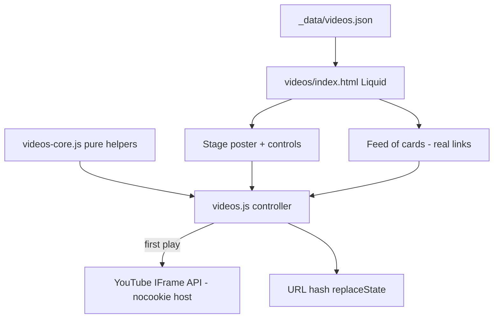

# ID-TV Video Player Design

**Spec**: `.specs/features/videos-player/spec.md`
**Status**: Draft

---

## Architecture Overview

Approaches considered (all deliver the same scope):

| Approach | Trade-off | Verdict |
| --- | --- | --- |
| **A. Poster facade + one lazy `YT.Player`** | Zero YouTube requests on load; needs the IFrame API for the `ended` event (auto-advance); one player reused with `loadVideoById` | **Chosen** |
| B. Plain `<iframe>` swapped per selection | Simpler, but cannot detect the end of a video, so no AUTO | Rejected: violates VPLR-13 |
| C. Keep 10 iframes and hide 9 | No refactor of embeds | Rejected: keeps the 10-iframe cost (Goal 1) |

Server side, Eleventy renders the whole feed from `_data/videos.json`. Client side, `videos-core.js` holds pure logic (index math, hash resolution, title formatting) and `videos.js` wires DOM, hash and the YouTube player.



State model in `videos.js`: `{ index, playing, auto, apiState: 'idle' | 'loading' | 'ready' | 'failed' }`.
- select(i, {play}) sets `index`, updates card `aria-current`, counter, title, hash and poster.
- If `play` is true and the API is `ready` the existing player runs `loadVideoById`; if `idle` the API script is injected and the pending selection plays once `ready`; if `failed` the fallback is shown.
- Rapid selections overwrite one `pending` index, so only the last one loads (VPLR-10).

---

## Code Reuse Analysis

### Existing Components to Leverage

| Component | Location | How to Use |
| --- | --- | --- |
| `.cyber-zone`/`.cyber-panel` pattern | `less/band.less` (reference), `less/photos.less` (with reduced-motion) | Copy into `less/videos.less` with `videos-*` keyframes, per project convention |
| Photos data-driven page | `photos/index.html`, `_data/photos.json` | Same Liquid loop pattern and `data-*` hooks |
| Photos carousel behavior | `assets/js/photos.js` | Reference for focus scope and arrow-key rules |
| Playwright helper blocking external hosts | `tests/photos/browser.cjs` | Reuse; YouTube API is stubbed per test |
| Photos test layout | `tests/photos/*.test.cjs`, `*.e2e.cjs` | Same split: node:test for data/logic, Playwright for browser behavior |

### Integration Points

| System | Integration Method |
| --- | --- |
| `_includes/js/videos.liquid` | Keeps `pack` include, loads `videos-core.js` then `videos.js` |
| `less/style.less` | Already imports `videos.less`; `npm run less:build` regenerates `assets/css/style.min.css` (tracked) |
| `playwright.config.cjs` / `package.json` | `testDir` widened from `./tests/photos` to `./tests`; unit glob to `tests/*/*.test.cjs` |

---

## Components

### Video catalog

- **Purpose**: Single source of truth for the 10 videos.
- **Location**: `_data/videos.json`
- **Interfaces**: array of `{ id, slug, title, type }`; `title` is the full YouTube title.
- **Reuses**: `_data/photos.json` convention.

### videos-core (pure helpers)

- **Purpose**: Deterministic logic with no DOM.
- **Location**: `assets/js/videos-core.js` (browser global `IDTV` plus `module.exports` for node tests)
- **Interfaces**:
  - `shortTitle(title: string): string` - strips the `Insane Driver - ` prefix.
  - `indexFromHash(hash: string, slugs: string[]): number` - exact match, else 0.
  - `step(index: number, delta: number, length: number): number` - wrapping.
  - `watchUrl(id: string): string`, `posterUrl(id: string): string`
  - `formatCounter(index: number, length: number): string` - `03 / 10`.

### Page markup

- **Purpose**: Server-rendered stage shell, feed and controls, working without JS.
- **Location**: `videos/index.html`
- **Interfaces (data hooks)**: `data-idtv`, `data-idtv-stage`, `data-idtv-poster`, `data-idtv-play`, `data-idtv-now`, `data-idtv-counter`, `data-idtv-prev`, `data-idtv-next`, `data-idtv-auto`, `data-idtv-feed`, `data-idtv-card="<index>"` with `data-slug`, `data-video-id`, `data-idtv-fallback`.
- **Reuses**: `cyber-zone`/`cyber-panel` markup from `photos/index.html`.

### Theme

- **Purpose**: Cyberpunk look, monitor frame, cards, scroll-snap feed.
- **Location**: `less/videos.less` (replaces the 2-line file), compiled into `assets/css/style.min.css`.
- **Reuses**: palette and keyframes copied per convention; reduced-motion rule modeled on `photos.less`.

### videos.js (controller)

- **Purpose**: Progressive enhancement of the server-rendered page.
- **Location**: `assets/js/videos.js` (rewritten; old 15-player code removed)
- **Interfaces**: internal `select(i, opts)`, `loadApi()`, `onEnded()`, `showFallback()`.
- **Dependencies**: `videos-core.js`, YouTube IFrame API (`https://www.youtube.com/iframe_api`), player created with `host: 'https://www.youtube-nocookie.com'`.

---

## Data Models

```typescript
interface Video {
  id: string     // YouTube video id
  slug: string   // unique, lowercase kebab-case, used as #hash
  title: string  // full YouTube title, e.g. "Insane Driver - Ghosts [Official Lyric Video]"
  type: 'MUSIC VIDEO' | 'LYRIC VIDEO' | 'ACOUSTIC' | 'LIVE'
}
```

---

## Error Handling Strategy

| Error Scenario | Handling | User Impact |
| --- | --- | --- |
| IFrame API script blocked or 8s timeout | `apiState='failed'`, show `[data-idtv-fallback]` with watch link | Poster + "YouTube unavailable" + "Watch on YouTube" |
| Unknown or wrong-case hash | `indexFromHash` returns 0, URL untouched | First video poster |
| Player `onError` event | Same fallback as above for the current video | Same message |
| JS disabled | Nothing enhances; cards stay links | Feed of links to YouTube |

---

## Risks & Concerns

| Concern | Location (file:line) | Impact | Mitigation |
| --- | --- | --- | --- |
| Old script creates 15 `YT.Player` for 10 containers; missing containers likely throw | `assets/js/videos.js:91` | Current page may be partly broken | Rewritten wholesale (T8); not reproduced |
| Global `screenWidth` sizing with fixed pixel players | `assets/js/videos.js:13` | Not responsive on resize | Stage uses CSS 16:9 aspect ratio; iframe fills it |
| `host: 'youtube-nocookie.com'` option is not prominently documented by Google | new `videos.js` | Embed could ignore the host | Verified in a real-browser smoke check during validation; e2e asserts iframe `src` host |
| E2E tests use a stubbed IFrame API, so real API behavior is unproven | `tests/videos/yt-stub.cjs` | Stub can drift from real API | Manual smoke check with real Chrome in the Verifier step; stub only implements documented methods (`loadVideoById`, `onStateChange`, `onError`, `PlayerState.ENDED=0`) |
| `docs/` is a dangling gitlink; build writes there | repo root | Accidental commit inside docs | Never commit `docs/`; tasks commit only source and `assets/css/style.min.css` |
| `tests/photos` name in `testDir`/npm scripts | `playwright.config.cjs:4` | Videos tests not picked up | T1, T2 widen globs; gate counts assert new tests run |

---

## Tech Decisions

| Decision | Choice | Rationale |
| --- | --- | --- |
| Poster source | `https://i.ytimg.com/vi/<id>/hqdefault.jpg` | Stable, no key, exists for every video |
| Pure logic split | `videos-core.js` separate from DOM code | Unit-testable with `node:test`, matches Photos test split |
| Hash writes | `history.replaceState` | No back-button spam |
| Autoplay policy | Only after a user click; hash on load never plays | Browsers block autoplay; spec VPLR-29 |
| Extra files | `assets/js/videos-core.js`, `tests/videos/*` | Pure logic and tests |
